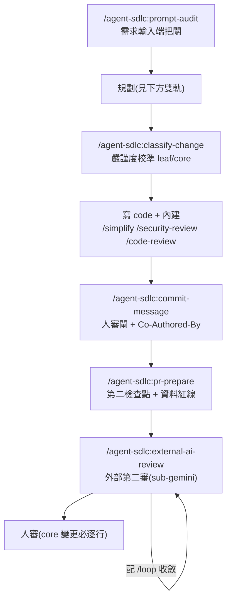

# agent-sdlc-skills

自足、可跨工作站共享、可共同維護的 **Claude Code plugin marketplace**,忠實複製 [appleboy(Bo-Yi Wu, MediaTek)](https://github.com/appleboy) 在 Cloud Summit 2026 LAB 提出的企業級 **Agent-Skill SDLC 工作流**。

整個 pack 是**單一 plugin `agent-sdlc`**,內含一條鏈的 **6 支 skill**:`prompt-audit` → `plan-feature` → `classify-change` → `commit-message` → `pr-prepare` → `external-ai-review`。

> **設計原則:不自行簡化關卡。** 每支 skill 忠於 appleboy 上游的把關強度,只在必要處疊上本地規範(commit 人審閘、Co-Authored-By 署名、通用資料紅線、每階段 context 檢查點)。唯一全新自寫的是 `external-ai-review`(見下方 Roadmap)。

---

## 安裝

pack = 一個 marketplace(`agent-sdlc-skills`)+ 一個 plugin(`agent-sdlc`)。裝好後 6 支 skill 一次到位。

### A. 從 GitHub 裝(發佈後;public repo 免 `gh auth`)

```
/plugin marketplace add TapiocaQAQ/agent-sdlc-skills
/plugin install agent-sdlc@agent-sdlc-skills
```

> **Windows 一律走 HTTPS,勿用 SSH** —— 私有 marketplace 在 Windows+SSH 有已知 bug([#20589](https://github.com/anthropics/claude-code/issues/20589))。本 repo 為公開,`marketplace add` 連憑證都不需要。

### B. 從本地路徑裝(開發 / 離線 / 尚未發佈)

```
git clone https://github.com/TapiocaQAQ/agent-sdlc-skills.git
claude plugin marketplace add ./agent-sdlc-skills
claude plugin install agent-sdlc@agent-sdlc-skills
```

### 跨工作站同步 / 共同維護

- **同步**:`git pull` 後 `/plugin marketplace update`。
- **共同維護**:改動走 git PR;每支 skill 是 `SKILL.md`(英文,唯一 active)+ `SKILL.zh-TW.md`(中文鏡像),**兩版一起改**。
- **驗證**:改完在 repo 根跑 `claude plugin validate . --strict`(marketplace + plugin manifest 全過才算數)。

---

## 6 支 skill

顯式調用一律是 **`/agent-sdlc:<skill>`**(如 `/agent-sdlc:pr-prepare`);也可依 skill 的 `description` 讓 Claude **自動觸發**(自然語言描述任務即可)。

| # | Skill | 調用 | 做什麼 |
|---|---|---|---|
| 1 | `prompt-audit` | `/agent-sdlc:prompt-audit` | 送 prompt 給 AI 前的**輸入端品質閘**:查 6 要素(Goal / Scope / Existing Patterns / Constraints / Verification / Done)評 Clear / Vague / Missing,並給改寫版。 |
| 2 | `plan-feature` | `/agent-sdlc:plan-feature` | **自足**的功能規劃:單檔 `plan.md`、錨定實際檔案的 Mermaid、釘死 3 個 e2e(1 happy + 2 error)+ 每階段 context 檢查點。 |
| 3 | `classify-change` | `/agent-sdlc:classify-change` | coding 前的**嚴謹度校準閘**:6 問判 leaf / core、較嚴者勝 → 定 reviewer 數、review 深度、e2e 數。 |
| 4 | `commit-message` | `/agent-sdlc:commit-message` | 分析 staged diff 生 conventional commit 訊息。**人審閘**(先秀完整訊息、批准才 commit)+ 強制 `Co-Authored-By` 署名尾行。 |
| 5 | `pr-prepare` | `/agent-sdlc:pr-prepare` | 產 PR 描述。Step 3 對**真實 diff** 重套 `classify-change` 準則(第二檢查點,抓「規劃 leaf 實作漂成 core」)+ 通用資料紅線 checklist。 |
| 6 | `external-ai-review` | `/agent-sdlc:external-ai-review` | 外部 AI **第二審**(v1 = sub-gemini,經瀏覽器驅 Gemini)。單輪 check-fix 配 `/loop` 收斂到乾淨;送 diff 給外部前**強制去敏**;本地、pre-PR、$0。 |

---

## SDLC 串法

appleboy 的原鏈(blog 查證)大致是:

```
/plan-feature → /simplify → /security-review → /code-review max -fix
             → /commit-message → /pr-prepare → AI review(copilot/codex)→ /loop 3m /copilot-review
```

其中 `/simplify`、`/security-review`、`/code-review` 是 **Claude Code 內建指令**(不在本 pack,由使用者自行搭配)。本 pack 提供其餘關卡,對映如下:



---

## 主動導引:`sdlc` 導航 + 進度檔

上面那條鏈是**流程地圖**;真正跑起來時,你不用自己記在第幾關。pack 有一支導航 skill 幫你導引:

- **`/agent-sdlc:sdlc`** —— 進度檔的**更新器 / 導航器**:讀「每功能一支」的進度檔 + git 狀態,勾選已完成關卡、刷新「📍目前位置 → ⏭下一步 → 卡點」,回報下一步。它**只導航,不跑鏈**(不替你跑下一關、不核可人審閘、不 commit)。
- **跑完整流程時每過一關自動更新**:當進度檔存在(即在跑整條鏈),6 支關卡 skill(prompt-audit / plan-feature / classify-change / commit-message / pr-prepare / external-ai-review)收尾會回呼 `/agent-sdlc:sdlc`,免你手動叫;**單獨用一支 skill 時不回呼、只在該支收尾提醒下一步**。內建 5–7 關(`/simplify`·`/security-review`·`/code-review`)無法自回呼,由下一個 pack 關卡(commit-message)追認。
- **進度檔**:每功能一支,放**開發 repo** 的 `docs/sdlc/<feature>-sdlc-progress.md`,是 **gitignored working scratch**(同 mem-tmp 性質,絕不進版控)。模板隨 pack:`plugins/agent-sdlc/templates/sdlc-progress.template.md`;`sdlc` 初始化時複製一份到開發 repo。
- **結案**:第 11 關人審合併、PR merge 後,進度檔**直接刪、不歸檔**——commit 與 PR 就是永久紀錄。

完整 12 步 SOP(含 🚦人審閘×4、⛔去敏×1、內建×3)見 [`SOP.md`](SOP.md)。

隨時想知道「我到哪了、下一步做什麼」,打 `/agent-sdlc:sdlc` 即可。

---

## 規劃鏈 + planning-exit checklist

> 🔴 **2026-08-06 更正**:這節原本寫「兩條路,開工時人選一條」——**那個框架是錯的**,而且那句話只活在
> README(文件,執行時不載入)裡,所以**永遠不會在該觸發的當下出現**。實測後果:直接打
> `/agent-sdlc:plan-feature` 時完全沒人提起還有另一條路。
> 現已改為**串起來**,並搬進 skill 本體(`sdlc` 初始化 + `plan-feature` Step 1 之前),執行時才擋得到。

兩支工具在**不同高度**、**可以疊**,不是替代關係:

| 階段 | 工具 | 產出 | 沒裝時 |
|:--|:--|:--|:--|
| a. 釐清 + 比方案 | **`superpowers:brainstorming`**(第三方 [obra/superpowers](https://github.com/obra/superpowers),**不 vendor 進本 pack**) | 經核可的 design/spec;強制 2–3 個方案比 trade-off、一次只問一題、HARD-GATE 擋住未核可就開工 | 略過,直接進 b |
| b. **決策層(必跑)** | **`/agent-sdlc:plan-feature`**(本 pack 自帶、忠實 appleboy、自足) | 目標、may-modify + **must-not-touch**、驗證策略、Mermaid、風險、**回滾** | — |
| c. 實作層 | **`superpowers:writing-plans`** | 逐 task 的 red-then-green 步驟(每個 task 內建負向對照) | 略過 |

**b 永遠不可跳過。** a 與 c 沒裝就略過並註明——這就是原本說的「優雅降級」,只是降級的粒度從「整條路」變成「其中一段」。

⚠️ **c 不能替代 b**:`writing-plans` **沒有** must-not-touch 雙清單、**沒有**回滾、**沒有** Mermaid,
而且它**沒有任何一句**關於「減法型變更要配反向斷言」——TDD 的 red-green 保證「這條測試真的在測東西」,
**不保證「沒有刪過頭」**。那條在本 pack 的 `plan-feature` Step 4。

無論跑了哪幾段,**規劃退出前要滿足這張檢查表**(是 `plan-feature` 的 superset):

- [ ] **目標**一句話講清楚
- [ ] **Scope**:may-modify(可動哪些檔)+ **must-not-touch**(絕不碰哪些)
- [ ] **3 個 e2e**:1 happy(正常成功)+ 2 error(壞輸入/邊界,要優雅不崩)
- [ ] **減法型變更**(擋掉/剝掉/過濾/去敏/改寫):baseline 已量 ＋ 每條斷言都有**反向配對** ＋ 斷言寫成**集合運算** ＋ 有**負向對照**。**單向斷言不算數**(細節見 `plan-feature` Step 4)
- [ ] **錨定實際檔案的 Mermaid**(不是抽象方塊,是真的檔名/模組)
- [ ] **明確核可**:計畫經人 review 才動手
- [ ] **handoff 句**:交棒給實作者的一句話(誰接、從哪開始)

---

## `external-ai-review` 的敏感資料紅線 ⛔

這支會把 `git diff` **送出到外部 reviewer**(Gemini),所以有一條 appleboy 原版沒有、我方獨有的硬紅線:

> **diff 離開你的機器前,先剝除每一筆真實資料 / 密鑰 / 個資** —— 真實 CSV/DB 內容、載具號碼、驗證碼、`.env` 值、API key、token、真實使用者記錄。**只送程式碼 diff 與合成範例**。某段 hunk 不去敏就沒法給 → 換合成佔位,或略過並註記。

appleboy 的 `copilot-review` / `codex-review` 不需要這步(它們的 diff 已在 GitHub 內);我們的 diff 是往外送,所以去敏是強制關卡。

---

## Roadmap(日後可加的 reviewer)

`external-ai-review` 的 reviewer 是**可插拔介面**,不是硬綁某模型。日後可照同一介面加:

- **`copilot-review`** / **`codex-review`**(appleboy 原版,驅動 GitHub PR 上的 Copilot / Codex 機器人)。

> ⚠️ **費用實況(2026 查證)**:GitHub Copilot code review 功能**需付費 Copilot 訂閱**(Copilot Pro 約 $10/月起);OpenAI Codex 的 GitHub review 需至少 Plus($20/月)。公開 repo 只是**免除**「2026-06 起私有 repo 按 Actions 分鐘 / AI credits 計費」,**不等於功能免費**。appleboy skill 內「Free for open-source / no subscription」句已過時。
>
> 相較之下,本 pack 現用的 **sub-gemini 版 `external-ai-review` 永遠 $0**(用你既有的 Gemini 存取)、且能在**開 PR 之前**就跑。

---

## 雙語鏡像慣例

每支 skill 兩個檔,同目錄:

- **`SKILL.md`(英文)** —— 唯一被 Claude 載入 / 觸發的權威版。
- **`SKILL.zh-TW.md`(中文)** —— 全譯鏡像,給中文語系維護者 / 讀者看,**不被當 skill 觸發**。

**每次改動兩版一起更新。** 英文 description 觸發中文輸入靠語意理解。

---

## 致謝與授權

- **淵源**:[appleboy(Bo-Yi Wu)](https://github.com/appleboy) 的 [`appleboy/skills`](https://github.com/appleboy/skills) 與其 Cloud Summit 2026 LAB「When AI Can Already Write Code」。5 支 skill 由其上游 vendored + 本地化,`external-ai-review` 為本 pack 新寫。
- **授權**:MIT(見 [`LICENSE`](LICENSE))。
