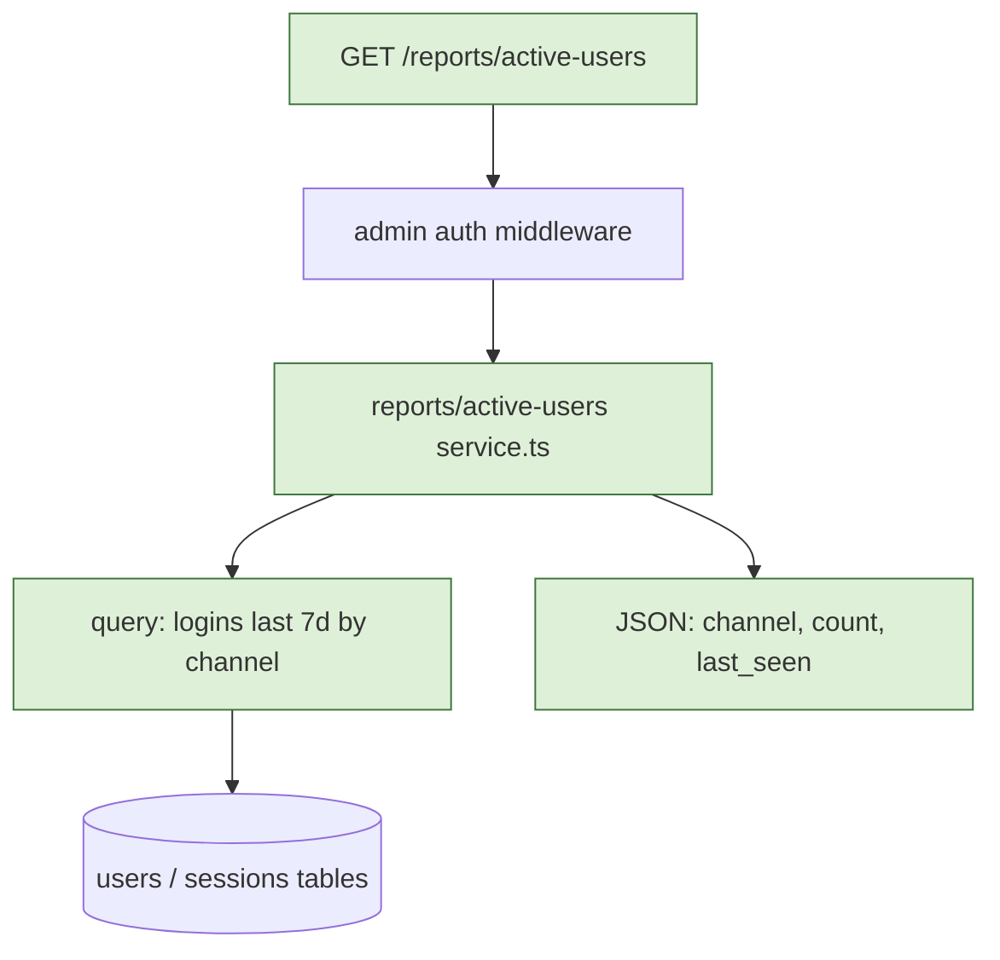

# plan-feature(中文鏡像)

> 📌 本檔是 `SKILL.md`(英文權威版)的中文鏡像,給中文語系維護者/讀者閱讀用。**Claude 實際載入/觸發的是英文 `SKILL.md`;本檔不會被當 skill 觸發。** 兩版內容一一對應,**每次改動兩版必須一起更新**。

大多數失敗的 AI 寫程式對話,不是因為模型無能而失敗。它們失敗,是因為人類沒給它足夠的 context。這支 skill 在任何程式碼被寫出來之前,把使用者變成 Claude 的產品經理約 15 分鐘,大幅提高實際實作的成功率。

產出是一份 `plan.md` 檔案,捕捉一個稱職工程師無歧義地把功能做出來所需的一切——**包含一張所提設計的圖**,因為實作者從一張圖抓到預期的形狀,遠比從一段散文描述快。

## 何時使用

只要使用者要求建造某個非瑣碎的東西就用。觸發情境包括:

- 「加一個 X 功能」
- 「建 / 實作 / 建立 / 上線 X」
- 「我想在 app 加 X」
- 「我們來做 X」
- 任何點名了功能卻沒給檔案路徑的 prompt

不要用於:錯字修正、單行 config 變更、簡單改名,或使用者已經提供完整 spec 時。

## Step 1 之前 —— 你是不是跳過了上游的一段?

這支 skill 是三段規劃鏈的**決策層**。若環境裝了 `superpowers:brainstorming`,而這個功能有一點複雜或模糊,
**先跑它**——它強制攤出 2–3 個方案比 trade-off、而且一次只問一題,這兩件事本 skill 的 Step 1 都沒有。
跑完再回來,brainstorming 的 spec 就是這份 plan 的輸入。

**明講你現在在哪一段**,讓使用者能在你花掉約 15 分鐘規劃到錯方向之前把你轉向。
若沒裝 brainstorming、或功能小而清楚,就直接進 Step 1 並說明。
完整的鏈(以及 `superpowers:writing-plans` 接在本 skill 之後的位置)寫在 `/agent-sdlc:sdlc` 的初始化步驟。

## 八步工作流程

依序執行。在「使用者核可」那步停下,才進到草擬程式碼。

### Step 1 — 釐清目標

問使用者 1–3 題:

- 誰是這功能的使用者 / 消費者?(內部團隊、終端使用者、系統)
- 「完成」長什麼樣?(一兩句話)
- 已知的限制有哪些?(deadline、技術棧、不可碰的區域)

拿到一段使用者已確認的問題陳述前,不要往下走。

### Step 2 — 探索 codebase

設計前先環顧四周。用 Read、Grep、Glob 來:

- 找到最可能放新程式碼的目錄
- 指認 1–2 個結構上相似的既有功能(這些就是要遵循的模式)
- 記下慣例:命名、檔案佈局、測試框架、錯誤處理風格
- 指認這功能很可能會複用的共用工具
- 劃出 `core` 程式碼(auth、payment、schema、共用框架)vs `leaf` 程式碼(功能本身)的邊界

如果 codebase 很大或陌生,問使用者針對性的問題:「auth 在哪裡發生?」「給我看一個跟 X 相似的既有功能。」

### Step 3 — 界定 scope

產出兩張清單,與使用者一起確認:

- **可以被修改的檔案 / 模組**
- **絕對不可修改的檔案 / 模組**(尤其是不該累積 AI 寫出來的技術債的 core 程式碼)

如果這功能自然會動到 core 程式碼,明確地把它攤出來,並討論這變更是否該拆成「人主導的 core 變更」加上「leaf 節點的功能變更」。

### Step 4 — 決定驗證策略

在寫任何程式碼之前,先就「正確性要怎麼檢查」達成共識:

- 哪 3 個 end-to-end 測試能證明功能可運作?(1 個 happy path、2 個 error case——保持在使用者可觀察的層級,不是實作細節)
- 需要什麼手動驗證步驟(若有)?
- 對長時間運行或非同步的功能:需要什麼壓力 / soak 測試?
- 這功能在 production 要怎麼被觀察(logs、metrics)?

驗證設計先於實作設計——這就是「可驗證檢查點」原則。

**如果這個變更是減法型的——它擋掉、剝掉、過濾、去敏、或改寫掉某些東西——單向斷言一律不算數。**
「有沒有把 X 拿掉?」這種問題,**把全部都拿掉就會通過**。所以每一條限制型斷言都必須配一條存活型斷言:

- **動工前先量 baseline。** 把「改之前」的完整狀態快照下來——完整清單、完整全文、時間數字。
  沒有 baseline,「沒有多剝別的」無從比較,「沒有變慢」也無法否證。
- **每條斷言都要配對。** 每一條「X 必須不見」,都要配一條「除了 X 以外的都還在」——
  該原封不動的地方要**逐字相同**;被改寫(而非刪除)的地方要**非空且仍堪用**。**清空不算改寫過關。**
- **斷言寫成對 baseline 的集合運算**,不要寫死數量或手抄清單。
  `set(baseline) - set(after) == {預期的那幾個}` 抓得到「少一個又多一個」;只比數量的話這兩者會互相抵銷。
  手抄的清單則會在母體變動的當下悄悄過期。
- **負向對照是另一件事,兩個都要。** 配對防的是「改過頭」;負向對照(餵一個已知會壞的輸入,要求它必須 FAIL)
  防的是「檢查器根本沒在檢查」。

這條防的是實作者——**包括未來的 Claude 自己**——在變更卡住時走最省事的路:
多剝一點是最順手的解法,也是最不會被察覺的。

### Step 5 — 把設計畫成圖

到這裡你已經知道目標、周邊程式碼、以及 scope——足以在任何東西存在之前,畫出**這功能會怎麼組合起來**。畫出來讓所提設計變得可審查:錯誤的邊界或漏掉的呼叫,在圖裡很容易抓到,在一段散文裡很容易漏掉。用 **Mermaid** 畫,這樣它在 GitHub/Gitea 上能原生渲染在 `plan.md` 裡、跟著 plan 走、並在設計演進時乾淨地 diff。

依這功能主要**是什麼**來挑圖型:

| 這功能主要關於…                                                                          | 用                | Mermaid 標頭                                  |
| ---------------------------------------------------------------------------------------- | ----------------- | --------------------------------------------- |
| 隨時間的互動/交握(auth 流程、request 生命週期、服務間 / 前後端的呼叫)                   | 序列圖            | `sequenceDiagram`                             |
| 控制流、決策邏輯、或一條 pipeline(分支、資料轉換、job 步驟)                             | 流程圖            | `flowchart TD`                                |
| 新的或重接的模組 / 套件 / 服務(結構性依賴)                                             | 元件圖            | `flowchart LR`,每個模組一個 `subgraph`        |
| 一個狀態機(狀態轉換、token / job 生命週期)                                             | 狀態圖            | `stateDiagram-v2`                             |

讓圖保持誠實且可渲染的規則:

- **每個節點都錨定到 plan 的 scope,不是想像。** 每個框都必須對映到「May modify」清單會建立或動到的檔案/模組,或它整合的既有元件。一張畫著「plan 實際上不會建」的理想架構的圖,會誤導實作者——跟一段模糊的目標是同一種失敗模式。
- **標出新 vs 既有。** 給新元素一個明顯不同的節點樣式,例如 `style NewSvc fill:#dff0d8,stroke:#3c763d`,並把功能插入的既有程式碼用預設樣式畫,讓邊界一目瞭然。逐節點的 `style` 行有效;`%%{init: ...}%%` 主題指令則**無效**——GitHub 會把它剝掉。
- **保持在 ~15–20 個節點以下。** 對非常大/複雜的圖,GitHub 會退回純文字(或 timeout)。如果設計塞不進這個預算,那就是個訊號:這功能大概該拆成更小的 plan。
- **寬的時候 `TD` 優於 `LR`。** GitHub 渲染在 markdown 欄寬內;寬的圖會逼出水平捲動。把相關節點用 `subgraph` 群組起來讓它們換行。
- **不要 `click` handler / 互動**——GitHub 渲染的是靜態 SVG,會忽略它們。

如果功能真的瑣碎,就跳過圖並說明——不要畫一個單框圖。使用者在 plan review(Step 7)時確認這張圖。

### Step 6 — 草擬 plan.md

用這個模板把 plan 寫到工作目錄的 `plan.md`。要具體,不要抽象。

````markdown
# Plan: <feature name>

## Goal
<1 段問題陳述,誰用它,完成長什麼樣>

## Architecture / flow
<所提設計的 Mermaid 圖。瑣碎功能省略此段。>



## Scope

### May modify
- src/path/to/file.ts
- src/path/to/dir/

### Must not modify
- src/auth/*
- src/db/schema.ts

## Existing patterns to follow
- 模仿 `src/reports/revenue.ts` 的結構:
  - `service.ts` 放查詢
  - `route.ts` 放 HTTP handler
  - `*.test.ts` 放測試

## Constraints
- 不加新的第三方依賴
- 查詢延遲 < 500ms
- 必須用既有的 admin auth middleware

## Verification
- 3 個 end-to-end 測試:
  1. Happy path:<以使用者可觀察層級描述>
  2. Error case:<描述>
  3. Error case:<描述>
- 壓力測試:<若適用>
- 手動驗證:<若適用>

## Done definition
- [ ] 3 個 e2e 測試全過
- [ ] PR 描述正確標記 AI 著作
- [ ] 沒有在「may modify」清單以外的變更
- [ ] <其他領域特定的準則>

## Execution checkpoints (context)
對於跨多階段或多次執行的 plan,每個階段結束時做一次 context 檢查點:
- [ ] 檢查 context 用量;若偏高,先更新續接筆記(已完成 / 進行中 / 下一步 / 卡點)
- [ ] 然後建議使用者 `/compact`
- [ ] 在同一檢查點 reconcile task / todo 清單

## Risks & rollback
- 風險:<可能出什麼錯>
- Rollback:<怎麼回復>

## Open questions
- <任何仍有歧義的東西>
````

### Step 7 — 取得明確的使用者核可

把 plan 給使用者看並問:「這樣看起來對嗎?有什麼要加或拿掉的?」明確地帶他們走一遍圖——一個錯的箭頭或一個漏掉的模組,在這裡修比程式碼寫完後修便宜太多。

不要跳過這步。plan 只有在使用者真的讀過並修正了任何偏移之後才有用。

如果使用者想現在就在這個對話裡寫程式碼,那也可以——但 plan 仍然是合約。回頭參照它。

### Step 8 — 建議交棒

核可後,建議使用者:

1. Compact 當前對話(或開一個新的)
2. 用這句開始下一個對話:「Execute the plan in plan.md. Do not deviate from the scope. Stop and ask if you find ambiguity.」

這個分隔很重要:規劃對話常常填滿 80k+ token 的探索。Compact 把它降到幾千,並給執行對話一個乾淨的聚焦。

**每階段 context 檢查點(不只在交棒時)。** 如果這份 plan 會跨多階段或多次執行,不要只在交棒時 compact 一次——在**每個階段**的結尾內建一個 context 檢查點:檢查 context 用量、若偏高先更新續接筆記、然後建議 `/compact`,並在同一點 reconcile task 清單。plan.md 模板的「Execution checkpoints」段把這個慣例帶進每一份產出的 plan,讓長執行保持可續接、絕不在階段中途撐爆 context window。

## 要避免的反模式

- **過度約束 prompt。** 不要規定每一個變數名。把重要的限制給模型,其餘讓它自己選。把 plan 當成給新進工程師的入職文件,不是填空表格。
- **跳過 codebase 探索。** 沒讀既有程式碼就寫出來的 plan,會產出不合這個 codebase 的程式碼。永遠先看。
- **模糊的驗證。**「它會動」不是驗證。三個具體的測試——一個 happy path 加兩個 error case——才是驗證。
- **讓 plan 動到 core 程式碼卻不標記。** 如果功能需要改 core,那需要人的擁有權和一個獨立的決定——把它攤出來,別埋起來。
- **畫一張不符合 scope 的圖。** 一張畫著 plan 不會建的理想設計的圖,比沒有圖更糟——把每個節點重新錨定到 scope(Step 5),或若塞不下就拆分功能。

## 範例

### 好的 plan 目標段

```
## Goal
Internal ops team needs a daily report of users who logged in within
the last 7 days, broken out by signup channel. Done means: an admin-
only endpoint at GET /reports/active-users that returns JSON with
{channel, count, last_seen} rows, sortable by count.
```

### 壞的 plan 目標段

```
## Goal
Active users report.
```

(太短。實作者無法分辨誰用它、「active」是什麼意思、或該回傳哪些欄位。)

## 停止條件

以下情況結束這支 skill:

1. `plan.md` 存在、使用者已核可、且交棒建議已給出,或
2. 使用者轉向想直接在這個對話裡做事(這種情況下 plan 仍作為合約——執行時回頭參照它)。

## 本關完成後

<!-- DELIBERATE DELTA(vs upstream appleboy/skills):回呼 sdlc 改為「進度檔存在才接」的條件式,單獨用一支不被逼進完整流程。刻意為之——別還原成無條件 REQUIRED 版。 -->

**在跑完整 agent-sdlc 生命週期?** 若有 `docs/sdlc/<feature>-<pr>-sdlc-progress.md`(或你刻意啟動整條 SOP 鏈),呼叫 `/agent-sdlc:sdlc`——它勾掉本關並回報確切的 ⏭ 下一步。只導航,不替你跑下一關。

**單獨用這支 skill?** 那你已完成——**不要**呼叫 `/agent-sdlc:sdlc`(沒有進度檔可更新)。若想繼續,通常接的下一步是 **gate 2 🚦planning-exit 人審檢查表,然後 gate 3 `/agent-sdlc:classify-change`**。
