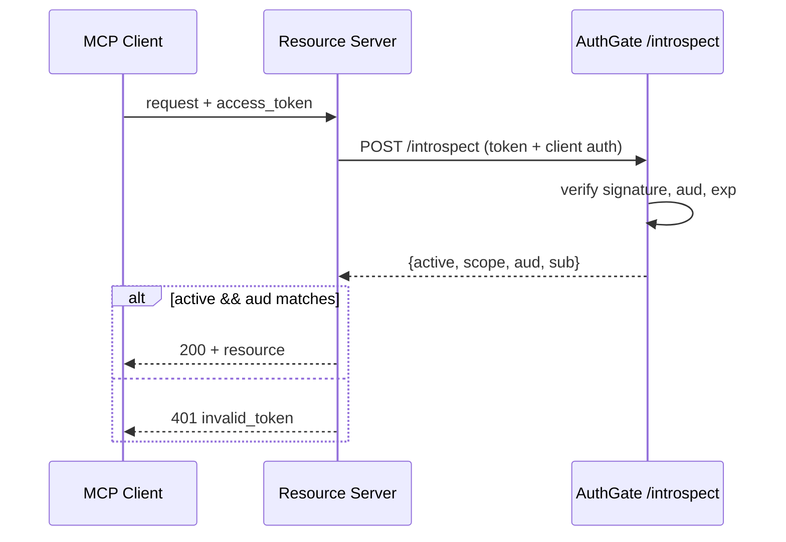

# pr-prepare(中文鏡像)

> 📌 本檔是 `SKILL.md`(英文權威版)的中文鏡像,給中文語系維護者/讀者閱讀用。**Claude 實際載入/觸發的是英文 `SKILL.md`;本檔不會被當 skill 觸發。** 兩版內容一一對應,**每次改動兩版必須一起更新**。
>
> ⚠️ **與上游 appleboy/skills 的改造(兩處實質內容,其餘忠實複製)**:
> 1. **Step 3 接線 `classify-change` 準則**:原作 Step 3 自帶一份精簡 leaf/core 定義 + quick diagnostic;本 pack **保留其獨立再分類**(忠於原作),但加一段接線——此為「PR 時的再分類」,對**真實 diff** 重套 `classify-change` 的 6 問準則,作為 plan 階段那次(憑意圖)判斷的**第二檢查點**(憑證據)。升級(leaf→core)要浮出當 finding、降級需人簽核。與 `classify-change` 的「下游契約」段對應。
> 2. **Step 5 checklist 資安紅線改為通用強化款**:原作只寫「No secrets / API keys / credentials」;本 pack 升級為**通用**款,涵蓋密鑰**與真實/production 資料**(真實 DB、資料 dump、下載的資料集、PII/真實使用者記錄)。用通用高度而非寫死某專案,pack 才能跨專案共用。

大多數含 AI 產出程式碼的 PR,都略過了審查者要正確評估它所需的「揭露」。這支 skill 產出的 PR 描述會把 AI 作者身分、變更分類、驗證狀態都講清楚——讓審查者知道哪些段落需要逐行細看、哪些可以抽查。它也把變更畫成圖,因為審查者從一張圖抓結構,遠比看檔案清單快。

## 何時使用

只要使用者即將開或推一個 PR 就用。觸發情境包括:

- 「Prepare a PR / open PR / push for review」
- 「Write a PR description」
- 「這功能我做完了,可以 ship」
- 「PR 描述我該寫什麼」
- 任何時候使用者提到合併、推送、或 pull-request 一個分支

只有在使用者明說「PR 我自己寫」或只想要原始 diff 輸出時才略過。

## 工作流程

### Step 1 — 讀變更

用 Bash 蒐集:

- `git status` —— 什麼 staged / dirty
- `git log <base>..HEAD --oneline` —— 分支上的 commit 訊息
- `git diff <base>...HEAD --stat` —— 檔案層級摘要
- `git diff <base>...HEAD` —— 小檔全看;大 diff 抽樣看改動段落

讀的時候,除了內容也記下變更的**形狀**——哪些檔/套件/服務是新的、哪些是改的、它們彼此怎麼呼叫。這是 Step 6 畫圖的原料。

若 `<base>` 不明顯,問使用者(通常是 `main` 或 `develop`)。

### Step 2 — 問 AI 作者身分

明確問使用者(不要臆測):

> 「AI 工具(Claude、Cursor、Copilot 等)有寫這裡任何程式碼嗎?若有,是哪些檔,以及哪些檔是你自己逐行審過的?」

記錄:

- **AI 寫的檔**:哪些
- **人逐行審過的**:哪些
- **用的工具**:例如「Claude Sonnet via Cursor」

若使用者說「我不記得」,把這標為一個問題——送出前他們應該要知道。

### Step 3 — 分類變更

判定變更是 `leaf` 還是 `core`:

- **葉節點(Leaf node)**:沒有其他東西依賴它。報表、單一端點、UI 元件、腳本、一次性 migration。故障是局部的。
- **核心程式(Core code)**:很多東西依賴它。Auth、payment、資料 schema、共用框架、公開 API、orchestrator。故障是全系統的。

若變更同時跨到兩者,標為 `core`(較嚴的規則套用到整個 PR)。

若不確定,問使用者一個快速 diagnostic:「如果這段程式碼有 bug,故障會擴散多遠?」

> **接線 —— 這是「PR 時的再分類」,用 `classify-change` 的準則。** 對**真實 diff** 套用 `classify-change` 的 6 問準則(傳播範圍、變更頻率、技術債、例子契合、故障成本、review 強度——較嚴者勝)。這是刻意設計的第二檢查點,蓋在 plan 階段那次判斷之上:那次憑的是**意圖**,這次憑的是**證據**。不要另發明一套準則——把那套共用準則對「程式碼實際變成的樣子」重跑一次。如果實作把一個原本規劃為 leaf 的變更漂移成 core(它現在動到了原本不該碰的共用模組),這道檢查**必須抓到**:**升級**(leaf → core)是一個要在 PR 裡浮上檯面的發現,絕不無聲放行;**降級**(core → leaf)需人簽核。上面那個快速 diagnostic 是「準則答案很明顯時」的快捷路徑。

### Step 4 — 偵測驗證

在 diff 裡找:

- 新增或修改的測試(數一數)
- 測試是端到端還是與實作耦合
- 長時程程式碼有沒有壓力 / soak 測試
- 重要路徑有沒有加 log / metric

若變更是 core、或測試少於 3 個,在生成 PR 描述前先向使用者點出——他們可能需要先補測試。

### Step 5 — 跑 pre-submit checklist

在產出 PR 文字前,和使用者走一遍這份 checklist。只問那些從 diff 看不出來是否已滿足的項:

- [ ] plan 存在 —— plan.md 或至少一份寫下的目標 + scope(即使是 leaf 工作也必要,雖然可以很輕;沒有 plan 的 PR 會被 code review 打回)
- [ ] PR 有界(可人審的 < 500 行;若更大,事先有協調過嗎?)
- [ ] 所有測試在本地通過
- [ ] diff 裡沒有密鑰、**也沒有真實 / production 資料** —— API key、憑證、token、真實 DB / 資料 dump / 下載的資料集、PII / 真實使用者記錄。這些屬於 `.gitignore`,永不進版控;若 diff 裡出現任何一個,停下來、在 PR 之前移除它。
- [ ] plan 裡的 `must not modify` 邊界有被尊重(若當初有 plan)
- [ ] 若碰到 auth / payment / 外部 API:額外資安審查已做

若有任何一項 fail,停下來並點出。**不要**為一個還不該開的 PR 產出描述。

### Step 6 — 把變更畫成圖

要展示變更**怎麼組在一起**,一張圖勝過一段文字。用 **Mermaid** 畫:GitHub 在 PR body 原生渲染 Mermaid(GitLab、Gitea 也是),所以它隨描述一起走、免圖床,架構變動時 diff 也乾淨。下面的渲染規則是 GitHub 的——常見 host 裡最嚴的——所以滿足它們的圖到處都能渲染;在別的 host 上你可以放寬(例如 Gitea 認 `%%{init}%%` 主題與較大的圖)。

依變更**實際是什麼**選圖型:

| 變更主要關於…                                                                     | 用                | Mermaid 表頭                                   |
| --------------------------------------------------------------------------------- | ----------------- | --------------------------------------------- |
| 隨時間的互動/握手(auth flow、request 生命週期、服務間 / MCP client↔server 呼叫) | Sequence diagram  | `sequenceDiagram`                             |
| 控制流、決策邏輯、或一條 pipeline(分支、資料轉換、CI 步驟)                       | Flowchart         | `flowchart TD`                                |
| 新增或重接的模組 / 套件 / 服務(結構性依賴)                                       | Component diagram | `flowchart LR`,每個模組一個 `subgraph`        |
| 一個狀態機(狀態轉移、token / job 生命週期)                                       | State diagram     | `stateDiagram-v2`                             |

讓圖保持誠實且可渲染的規則:

- **每個節點都從 diff 推導,不是從想像。** 每個框都要對應到 PR 實際碰到的一個檔、函式、套件或服務。若你追不回某節點到一行改動,刪掉它。畫「理想」架構而非「實際」變更會誤導審查者——跟含糊的「fixes the bug」摘要是同一種失敗。
- **標出改了什麼。** 給新/改的元素一個明顯的節點樣式,例如 `style NewSvc fill:#dff0d8,stroke:#3c763d`,把 diff 插進去的既有周邊程式留在預設樣式,讓界線一目瞭然。逐節點的 `style` 行有效;`%%{init: ...}%%` 主題指令**無效**——GitHub 會剝掉。
- **控制在 ~15–20 節點內。** 圖太大/太複雜時 GitHub 會退回純文字(或 timeout)。若變更塞不進這個預算,那是「這 PR 大概該拆」的訊號(見 Anti-patterns)。
- **寬的時候用 `TD` 而非 `LR`。** GitHub 在 markdown 欄內渲染;寬圖在桌面逼出水平捲動、在手機溢出。用 `subgraph` 把相關節點分組,讓它換行。
- **不要 `click` handler / 互動** —— GitHub 渲染的是靜態 SVG,會忽略它們。

若變更真的很瑣碎(一行修正、文案微調、依賴 bump),略過圖並說明——不要畫一個單框圖。

### Step 7 — 產出 PR 描述

用這個模板,把你知道的都填進去。只在你沒有該資訊時留清楚標記的 TODO 佔位。`Architecture / flow` 區塊緊接摘要之後,讓審查者在細節前先看到形狀。

````markdown
## Summary

<1-3 sentences: what this PR does and why>

## Architecture / flow

<Mermaid diagram of the change. Omit this section for trivial changes.>



## AI Authorship

- [ ] No AI was used in this PR
- [x] AI was used. Details:
  - **Tool / model**: <e.g., Claude Sonnet via Cursor>
  - **AI-authored files**: <list>
  - **Human line-by-line reviewed**: <list>

## Change classification

- [ ] Leaf node (local impact)
- [x] Core code (broad impact — needs line-by-line review)
      <or vice versa>

## Plan reference

<link to plan.md, or paste its goal + scope section>

## Verification

- [x] Unit tests
- [x] Integration tests
- [x] At least 3 e2e tests (1 happy path + 2 errors)
- [ ] Stress / soak test: <details, or N/A>
- Manual verification: <steps the reviewer should run>

## Verifiability check

- [x] Inputs and outputs are documented
- [ ] Reviewer can judge correctness from interface + tests alone (leaf only — core still needs line-by-line review)
- [x] Failures will surface in monitoring

## Security check (only if PR touches external interfaces)

- [ ] No secrets in code
- [ ] All external inputs validated
- [ ] Permission checks tested
- [ ] Rate limits applied
- [ ] Errors don't leak internals

## Risk & rollback

- **Risk**: <what could break>
- **Rollback**: <how to revert>

## Reviewer guide

- **Read carefully**: <files / functions that need close attention>
- **Spot-check OK**: <files / functions where tests + signatures suffice>
````

### Step 8 — 交接

產出描述後,告訴使用者:

1. 貼哪裡(通常是 GitHub PR body)
2. 建議的審查者數:leaf 用 1、core 用 2+(含模組 owner)
3. 建議快速渲染檢查——把 Mermaid 區塊貼進 GitHub PR 預覽(或 Mermaid Live Editor)確認能渲染再送出。
4. 若有 `gh` CLI 且使用者要,主動提議直接跑 `gh pr create --body-file <file>`。

## 要點出的 Anti-patterns

若在 diff 裡看到以下任何一項,在產出 PR 文字**之前**點出來。使用者可能想先修:

- AI 在 core 路徑寫的程式碼,卻沒註明有人逐行審過
- 沒有測試,只有「我本地測過了」
- AI 作者身分未揭露
- 碰到宣告 scope 以外的檔(若當初有 plan.md)
- 跨模組蔓延的 diff,暗示該拆成多個 PR
- 長時程 / 非同步程式碼卻沒有壓力測試
- 圖裡有節點對應不到改動的程式碼(架構虛構)——在產出 PR 文字前先修圖

## 輸出原則

- **要具體。** 別寫「fixes the bug」——寫是什麼 bug、在哪個檔、用什麼機制修的。
- **展示形狀。** 一張「改了什麼」的圖勝過一段描述它的文字——但只有在每個節點都對應到真實改動的程式碼時。
- **對齊既有 PR 風格**(若 repo 有慣例)。不確定就讀近期已合併的 PR。
- **先講風險。** 審查者應該立刻看到該細看什麼。
- **對 AI 誠實。** 審查者依此校準投入的力氣。隱瞞 AI 作者身分是壞 review 的最大單一來源。

## 本關完成後

<!-- DELIBERATE DELTA(vs upstream appleboy/skills):回呼 sdlc 改為「進度檔存在才接」的條件式,單獨用一支不被逼進完整流程。刻意為之——別還原成無條件 REQUIRED 版。 -->

**在跑完整 agent-sdlc 生命週期?** 若有 `docs/sdlc/<feature>-<pr>-sdlc-progress.md`(或你刻意啟動整條 SOP 鏈),呼叫 `/agent-sdlc:sdlc`——它勾掉本關並回報確切的 ⏭ 下一步。只導航,不替你跑下一關。

**單獨用這支 skill?** 那你已完成——**不要**呼叫 `/agent-sdlc:sdlc`(沒有進度檔可更新)。若想繼續,通常接的下一步是 **gate 10 `/agent-sdlc:external-ai-review`**。
